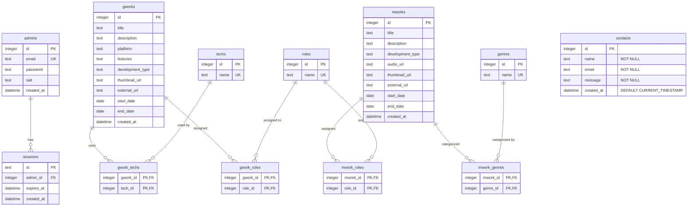

# テーブル定義

コードの簡潔さを重視し、以下の省略形を使用しています。

- `gworks` = Game Works (ゲーム制作実績)
- `mworks` = Music Works (音楽制作実績)
- `techs` = Technologies (技術スタック・タグ)
- `roles` = Roles (担当役割・タグ)
- `genres` = Genres (音楽ジャンル・タグ)

